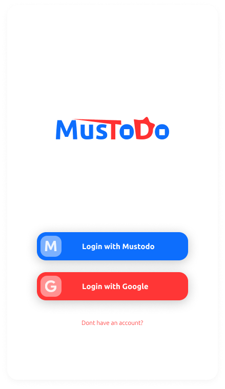
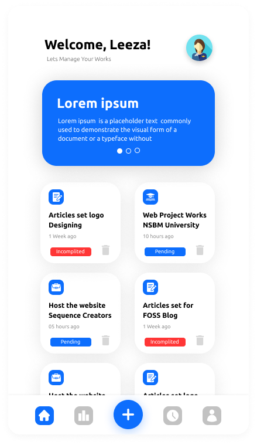
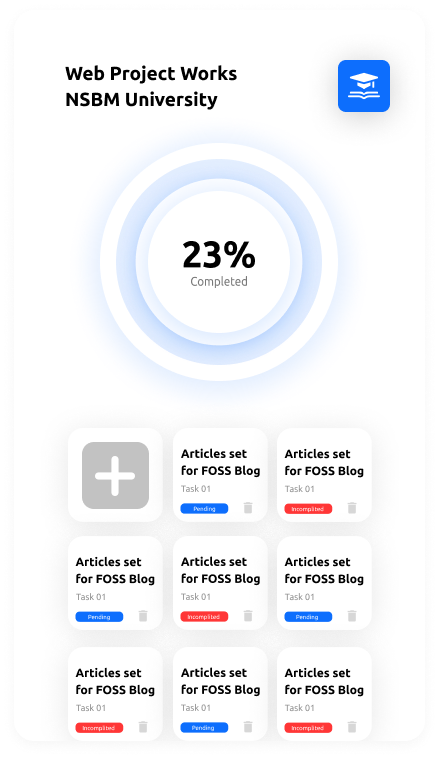
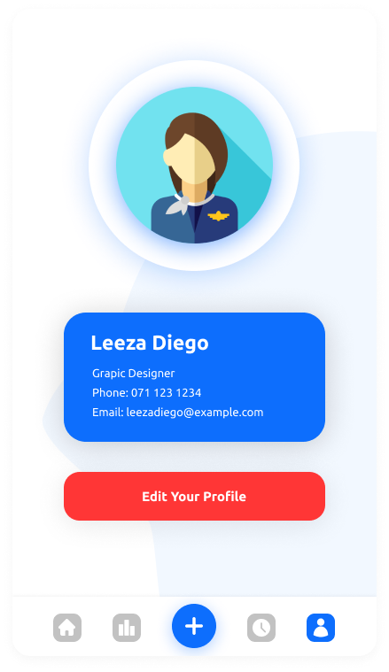

# Mustodo-Flutter-App

## What is Mustodo

Mustodo is a fully functional to do mobile application. If you want to contribute to developing this application, you can fix the issues and send a pull request.

## Which technologies are used

To develop this application I have decided to use the Dart language with the Flutter framework, because by using those we can easily develop both IOS and Android compatible applications.

## The user interface

The user interface is designed using Figma web. Here are some of the screenshots of this UI

### Welcome Page

### Home Page

### Todo Page

### Account Page

