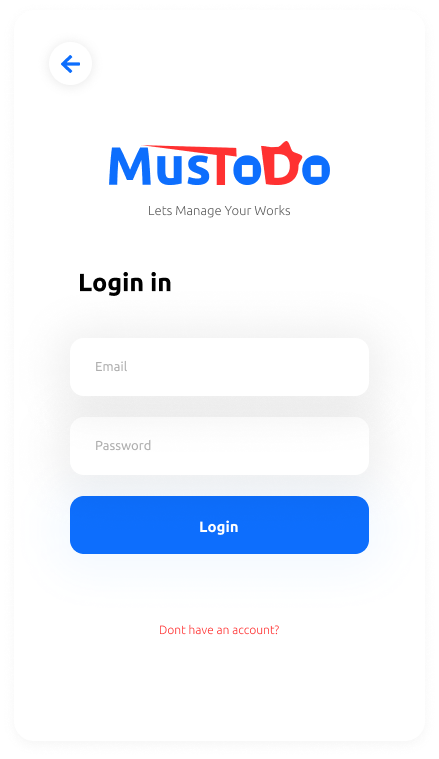
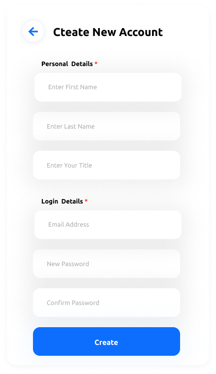

# Mustodo-Flutter-App

## What is Mustodo

Mustodo is a fully functional todo application. If you want to contribute to developing this application, you can solve the issues and send the pull request.

## Which technologies that used

To develop this application I am decided to use the Dart language with the Flutter framework. because it can easily develop both IOS and Android applications.

## The user interface

The user interface is designed by using Figma web. there is some of screenshots of this application

### Welcome Page

### Home Page

### Todo Page

### Account Page

